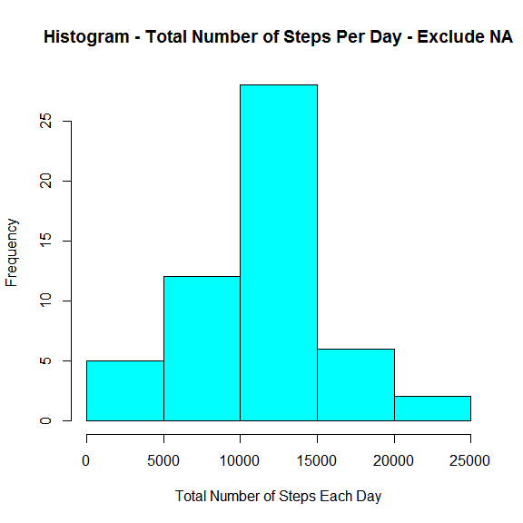
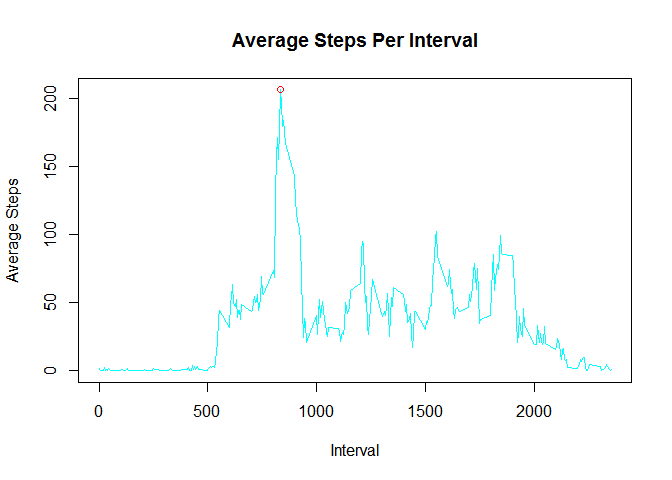
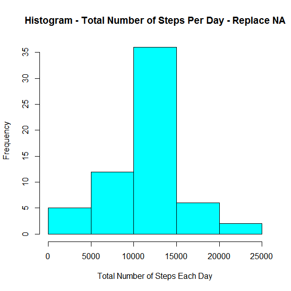

### General Information
 * message=FALSE and warning=FALSE are used to suppress warnings and mesages.  
 * Total Number of steps are plotted 3 ways
    * Histogram including NAs.
    * Histogram excluding NAs.
    * Time Series plot replacing NAs with mean for corresponding intervals.
 * NAs are excluded from calculation of Average steps per interval as they cause the averages to be NA.
        
## Loading and preprocessing the data
Download and unzip file

```r
    library(dplyr)
    URL <- "http://d396qusza40orc.cloudfront.net/repdata%2Fdata%2Factivity.zip"
    download.file(URL,destfile="activity.zip")
    unzip("activity.zip")
```
Read file using read.csv() into a dataframe and check dataframe summary.

```r
    activity <- read.csv("activity.csv")
    summary(activity)
```

```
##      steps                date          interval     
##  Min.   :  0.00   2012-10-01:  288   Min.   :   0.0  
##  1st Qu.:  0.00   2012-10-02:  288   1st Qu.: 588.8  
##  Median :  0.00   2012-10-03:  288   Median :1177.5  
##  Mean   : 37.38   2012-10-04:  288   Mean   :1177.5  
##  3rd Qu.: 12.00   2012-10-05:  288   3rd Qu.:1766.2  
##  Max.   :806.00   2012-10-06:  288   Max.   :2355.0  
##  NA's   :2304     (Other)   :15840
```
## What is mean total number of steps taken per day?
Calculate total number of steps per day using dplyr package. Total number of steps are calculated in two ways - including NAs and excluding NAs.
Include NAs in total calculation

```r
    total_steps_per_day <- activity %>%
                                  group_by(date) %>%
                                      summarize(total=sum(steps))
    hist(total_steps_per_day$total,xlab="Total Number of Steps Each Day", main="Histogram - Total Number of Steps Per Day - Inlcude NA",col="cyan")
```

 

```r
    mean_include_NA <- mean(total_steps_per_day$total)  
    median_include_NA <- median(total_steps_per_day$total)  
```
Mean of Total Number of Steps Per Day : NA  
Median of Total Number of Steps Per Day : NA    

Exclude NAs to avoid summarizing to NA, and to avoid setting mean and meadian to NA.

```r
    total_steps_per_day <- activity[!is.na(activity$steps),] %>%
                                  group_by(date) %>%
                                      summarize(total=sum(steps))
    hist(total_steps_per_day$total,xlab="Total Number of Steps Each Day", main="Histogram - Total Number of Steps Per Day - Exclude NA",col="cyan")
```

 

```r
    mean_exclude_NA <- mean(total_steps_per_day$total)  
    median_exclude_NA <- median(total_steps_per_day$total)  
```
Mean of Total Number of Steps Per Day : 1.0766189\times 10^{4}  
Median of Total Number of Steps Per Day : 10765    

## What is the average daily activity pattern?
Caluclate mean/average for each interval using summarize function. Also, calculate max average and corresponding interval and mark on the plot.

```r
    average_steps <- activity[!is.na(activity$steps),] %>%
                          group_by(interval) %>%
                                summarize(average=mean(steps))
    max_average <- max(average_steps$average)
    interval_max_average <- average_steps[average_steps$average==max_average,1]
    plot(average_steps$interval,average_steps$average,type = "l",ylab="Average Steps", xlab= "Interval",main = "Average Steps Per Interval", col="cyan")
    points(interval_max_average,max_average,col="Red")
```

 

```r
   # Plot maximum average using a red point.
```
Interval 835 has the maximum avarage of 206.1698113. Plotted using a red point.  

## Imputing missing values. 
Number of Rows with missing values = 2304  
Replace missing values with mean/average for the corresponding interval. 

```r
    for (int in unique(activity[,3]))
    {
        activity[is.na(activity$steps) & activity$interval==int,1] <-  average_steps[average_steps$interval==int,2]   
    }
```
Number of Rows with missing values after replacement = 0  

Calculate total number of steps per day using dplyr package. NAs are replaced with mean of corresponding interval. 

```r
    total_steps_per_day_wo_NA <- activity %>%
                                      group_by(date) %>%
                                          summarize(total=sum(steps))
    hist(total_steps_per_day_wo_NA$total,xlab="Total Number of Steps Each Day", main="Histogram - Total Number of Steps Per Day - Replace NA",col="cyan")
```

 

```r
    mean_wo_NA <- mean(total_steps_per_day_wo_NA$total)
    median_wo_NA <- median(total_steps_per_day_wo_NA$total)
```
Mean of Total Number of Steps Per Day with NA replaced : 1.0766189\times 10^{4}  
Median of Total Number of Steps Per Day with NA replaced : 1.0766189\times 10^{4}    

Comparison of mean and median without any action on NAs, excluding NAs and replacing NAs with mean for corresponding interval.

Handling Scenario     | Mean  | Median
----------------------|-------|------
No Action             | NA | NA 
Exclude NA            | 1.0766189\times 10^{4} | 10765 
Replace NA with Mean  | 1.0766189\times 10^{4} | 1.0766189\times 10^{4}

## Are there differences in activity patterns between weekdays and weekends?
Use lattice plot to plot the activity pattern for weekends and weekdays. Added a new column to activity data set to indicate whether a date is weekend or weekday.

```r
    library(lubridate)
    library(lattice)
    activity$weekday_end <-ifelse(weekdays(ymd(activity$date)) %in% c("Saturday","Sunday"),"weekend","weekday")
    average_steps <- activity %>%
                        group_by(weekday_end,interval) %>%
                            summarize(average=mean(steps))        
   # average_steps <- transform(average_steps, weekday_end=factor(weeday_end))
    xyplot(average ~ interval | weekday_end,
           data=average_steps,
           type="l",
           layout=c(1,2),
           xlab="Interval",
           ylab="Number of Steps",
           col="cyan")
```

 
